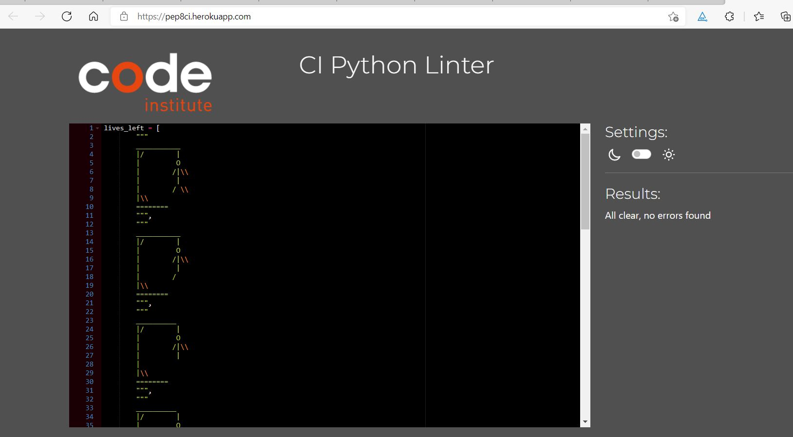

# World countries hangman game

## Project overview
Project 3 for Code Institute Full-stack development program: Python Essentials.

The theme for this Hangman game is Countries of the World.

Hangman is an age-old guessing game, traditionally played as a paper and pencil game for two or more players but easily adaptable to an electronic game for one plater. Players can try to guess the word by inputting letters until they either guess the word or it is game over. Players can play the game on three difficulties. Either Easy with 10 lives, Normal with 7 lives, and Hard with 5 lives. 

## How to Play
In this Hangman game players aim to guess the hidden name of a country. The country is represented by a series of dashes, each representing one letter in the country name. 

The player inputs a letter into the terminal, if the letter appears in the country name the corresponding dash will be replaced with the letter. If the letter does not appear they will lose a life. Players continue to enter letters until they correctly guess the country name or until they have exhausted all their lives.

## User experience
Users
1.	I want to be able to choose the level
2.	I want to play a fun and challenging game
3.	I want a visual aid to see how many lives I have left
4.	I want to read the rules of the game and understand how to play the game 
5.	I want to get a notification when the game is over 
6.	I want to have the choice to play the game again or to exit the game

Site owner

7.	I want users to be able to easily navigate the game

## Design

### Structure

## Features 

## Testing

### Validation
[pep8 online](http://pep8online.com/) was used for validating the python files. 

Lives page

### Responsiveness

### Testing user stories

### Bugs

## Deployment
The site was deployed via [Heroku]( https://id.heroku.com/login), and the live link can be found here: [Hangman – World Countries](https://world-countries-hangman.herokuapp.com/) 

### Github

This project was developed utilising the [Code Institute Template]( https://github.com/Code-Institute-Org/python-essentials-template). Some of the deployment steps below are specifically required for the new CI template and may not be applicable to older versions, or different projects.

Gitpod was used to write the code and push the code to repository created in github.

The git commands I used to push the code from gitpod to github were

`git add .` - This command was used to add the file(s) to the staging area before they are committed.

`git commit -m “commit message”` - This command was used to commit changes to the local repository queue ready for the final step.

`git push` - This command was used to push all committed code to the remote repository on github.

#### Clone the repository
The steps to clone a repository are as follows:
1.	Navigate to the GitHub repository you would like to clone
2.	Click on the code drop down button
3.	Click on the HTTPS tab
4.	Copy the repository link to the clipboard
5.	Open Git Bash
6.	Change the current working directory to the one where you want the cloned directory
7.	Type git clone and then paste the URL from the clipboard 
8.	Press Enter to create your local clone.

The repository will now be cloned on your local machine for use.

### Herouku
Before deploying to Heroku pip3 freeze > requirements.txt was used to add pyfiglet and Colorama imports for deployment

#### Setting up a new app
1. Log in to [Heroku]( https://id.heroku.com/login) 
2. Click the button labelled **New** from the dashboard in the top right corner and from the drop-down menu select **Create New App**.
3. A unique app name must be used.
4. Next, select your region, (I chose Europe as I am in Ireland).
5. Click on the **Create App** button.

#### Updating the settings 
* Click on the **Settings Tab** and scroll down to **Add Buildpack** 
* Select **python** and click **Save Changes**, then add **node.js**.
* **Note:** The Buildpacks must be in the correct order. If not click and drag them to move into the correct order.

#### Deploying the application
* Scroll to the top of the page and now choose the **Deploy** tab.
* Select **Github** as the deployment method.
* Confirm you want to connect to GitHub.
* Search for the repository name and click the connect button.

Scroll to the bottom of the deploy page and select preferred deployment type:
* Click either **Enable Automatic Deploys** for automatic deployment when you push updates to Github.
* Select the correct branch for deployment from the drop-down menu and click **Deploy Branch** for manual deployment.

## Technologies used
**Languages used**

**Programs used**

## Credits

### Media

### Code

### Other resources used

##  Acknowledgements